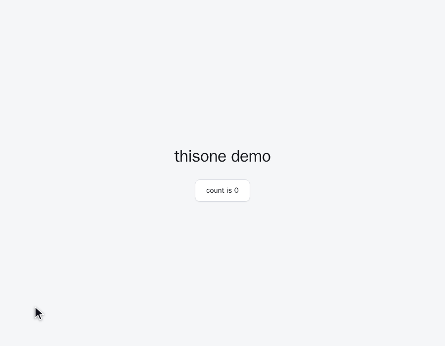

# thisone

**Point at it. Your AI agent gets the file, the line, and the pixels.**

[](https://www.npmjs.com/package/vite-plugin-thisone)
[](./LICENSE)

`dev-only` · `zero runtime` · `no network`



## The problem

You can see the bug. Your agent can't.

"The button in the third card is 2px off" is a perfectly clear sentence to a human looking at the
same screen, and nearly useless to an agent that has to guess which of your 40 components renders
that card. So it greps, opens the wrong file, patches the wrong rule, and you spend three messages
narrowing down a thing you could have pointed at in half a second.

The gesture that would fix this — _this one, right here_ — is exactly what a chat window doesn't have.

## The fix

Press **Alt+C**, click the element, press **Ctrl+V** in your agent's chat. That's it.

What lands in the paste:

```
<button> · Counter · /home/you/shop/src/components/Counter.vue:8:3-10:12
```

Tag, component name, and the exact source span — file, start line:column, end line:column. One click
on the screenshot instead, and you paste the element as a PNG with 30px of real surrounding page on
each side, so the agent sees the misalignment rather than reading about it.

## Quickstart

```bash
npm i -D vite-plugin-thisone
```

Vue:

```ts
// vite.config.ts
import { defineConfig } from "vite";
import vue from "@vitejs/plugin-vue";
import thisone from "vite-plugin-thisone";

export default defineConfig({
  plugins: [vue(), thisone()],
});
```

React:

```ts
// vite.config.ts
import { defineConfig } from "vite";
import react from "@vitejs/plugin-react";
import thisone from "vite-plugin-thisone";

export default defineConfig({
  plugins: [react(), thisone()],
});
```

Start your dev server and press **Alt+C**.

## What lands on your clipboard

The path text is built from three parts, in order:

| Part        | Example                   | Where it comes from                     |
| ----------- | ------------------------- | --------------------------------------- |
| Tag         | `<button>`                | the picked DOM element                  |
| Component   | `Counter`                 | the Vue or React component that owns it |
| Source span | `…/Counter.vue:8:3-10:12` | injected at transform time, dev only    |

It degrades instead of disappearing. No resolvable source location, but a known component and file:
`<button> · Counter (…/Counter.vue)`. No component at all: `<button> · main > div > button`.

Clicking the screenshot copies a PNG of the element to the clipboard, padded with 30px of the real
page around it — enough context to judge spacing and alignment, cropped tight enough to stay about
one element.

Both are plain clipboard writes. Nothing is uploaded, nothing is stored.

## Options

```ts
thisone({ hotkey: "KeyB" }); // Alt+B instead of Alt+C
```

| Option   | Type     | Default  | Meaning                                                                                                                                                   |
| -------- | -------- | -------- | --------------------------------------------------------------------------------------------------------------------------------------------------------- |
| `hotkey` | `string` | `"KeyC"` | [`KeyboardEvent.code`](https://developer.mozilla.org/en-US/docs/Web/API/UI_Events/Keyboard_event_code_values) that opens the picker together with **Alt** |

The panel is draggable and remembers where you left it. The icon button in its header enables an
edge-docked quick-access button — off by default, always on screen once enabled, right-click-drag to
move it around the viewport perimeter. Both survive a reload.

## Works with

- **Vue 3** — component name and source span via the SFC compiler.
- **React** — `.jsx` / `.tsx`, including `memo()`-wrapped and default-exported components. No
  dependency on `@vitejs/plugin-react`.
- **Vite 5, 6, 7.**

The plugin declares `apply: "serve"`. `vite build` output contains none of it — no overlay, no
injected attributes, no bytes shipped to your users.

## Why not just…?

|                                                                                      | What it does                                          | What you get                     |
| ------------------------------------------------------------------------------------ | ----------------------------------------------------- | -------------------------------- |
| [LocatorJS](https://www.locatorjs.com/)                                              | jumps **you** to the source in your editor            | a cursor in a file               |
| [click-to-component](https://github.com/ericclemmons/click-to-component)             | same, React-specific                                  | a cursor in a file               |
| [vite-plugin-vue-inspector](https://github.com/webfansplz/vite-plugin-vue-inspector) | same, Vue-specific                                    | a cursor in a file               |
| **thisone**                                                                          | puts the location **and a picture** on your clipboard | something to paste into an agent |

Those tools optimize for _you_ opening the file. This one optimizes for _handing the file to someone
who can't see your screen_. No editor integration, no protocol handler, no daemon — it works the
same whether your agent lives in a terminal, an IDE, or a browser tab.

## Privacy

No server, no network calls, no telemetry, no analytics. The picker runs in your page and writes to
your clipboard. That is the whole data flow.

## Development

```bash
pnpm install
pnpm run setup-hooks   # one-time: installs the husky git hooks
pnpm build             # -> dist/{index.js, client.js, index.d.ts}
pnpm test:run          # unit tests
bash scripts/e2e.sh        # e2e against examples/demo-app (Vue)
bash scripts/e2e-react.sh  # e2e against examples/demo-app-react
bash scripts/demo.sh       # re-record docs/demo.gif
```

Versioning is automatic: a husky `pre-commit` hook bumps the patch version, rebuilds `dist/` and
stages it whenever `src/` changes; a `post-commit` hook tags `v<version>`. For a larger bump run
`pnpm release minor` (or `major`) before committing.

`setup-hooks` is deliberately not wired to `prepare` — consumers who install straight from git would
otherwise have their package manager install our full `devDependencies` to run it, which can
recursively trigger `pnpm install` in their workspace root.

Design notes live in `docs/superpowers/specs/`.

## License

MIT
